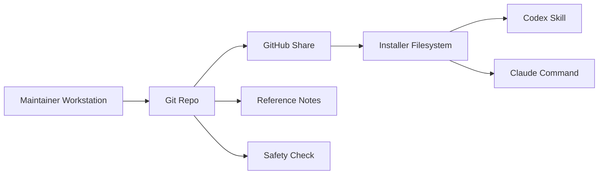

## Executive summary

This repository is a static AI-skill package, not a networked application, so its main risks are supply-chain and disclosure risks rather than remote code execution. The highest-risk areas are the install surfaces (`README.md`, `.claude/commands/write-well.md`) and provenance notes (`skills/write-well/references/source-notes.md`), because those files directly shape what downstream users install and what private or reputation-sensitive details can leak into a public GitHub repo.

## Scope and assumptions

- **In scope:** tracked repository content that ships or documents the skill: `README.md`, `.claude/commands/write-well.md`, `skills/write-well/**`, and commit hygiene controls in `.gitignore`.
- **Out of scope:** Git internals in `.git/`, ignored local artifacts under `.tmp_wp_oauth/`, and untracked source material under `sources/` except where accidental commit risk affects the repo's security posture.
- **Assumption:** this repo is intended to be shared publicly on GitHub as a portable skill package.
- **Assumption:** consumers install the Codex skill by copying `skills/write-well/` and/or the Claude wrapper by copying `.claude/commands/write-well.md` as documented in `README.md:33-62`.
- **Assumption:** the repo does not intentionally distribute copyrighted source texts; `README.md:80-82` and `skills/write-well/references/source-notes.md:5-12` now frame the books as off-repo influences only.
- **Assumption:** there is no CI-based enforcement yet; current protection is manual review, ignore rules in `.gitignore:1-4`, and the local pre-release scanner at `scripts/repo-safety-check.sh:1-44`.

Open questions that would materially change the risk ranking:

- Is the target distribution model public GitHub, private team sharing, or both?
- Do you plan to add automation (pre-commit or CI) before future releases?
- Will `sources/` remain purely local, or is there any plan to publish sanitized excerpts later?

## System model

### Primary components

1. **Install/documentation surface** — `README.md:33-72` tells users how to install the skill into Codex and Claude Code and how to run the release safety check.
2. **Codex skill payload** — `skills/write-well/SKILL.md:1-148` defines the portable skill behavior for Codex/OpenAI.
3. **Claude command wrapper** — `.claude/commands/write-well.md:1-56` provides a standalone slash-command prompt for Claude Code.
4. **Provenance/reference notes** — `skills/write-well/references/source-notes.md:1-44` records editorial grounding and external references.
5. **Local artifact guardrail** — `.gitignore:1-4` excludes `.tmp_wp_oauth/`, local source dumps, and `sources/` from accidental commit.
6. **Pre-release scanner** — `scripts/repo-safety-check.sh:1-44` scans tracked files for machine-specific paths, disallowed provenance domains, and obvious secret material.

### Data flows and trust boundaries

- **Maintainer workstation -> Git repository**  
  - **Data:** Markdown skill files, notes, local artifacts, temporary OAuth data.  
  - **Channel:** filesystem + git staging.  
  - **Security guarantees:** ignore-based exclusion via `.gitignore:1-4` plus the local scanner in `scripts/repo-safety-check.sh:1-44`.  
  - **Validation:** manual review plus an opt-in scripted scan.
- **GitHub repository -> downstream installer**  
  - **Data:** install instructions, prompt content, reference notes.  
  - **Channel:** git clone / file copy.  
  - **Security guarantees:** repository contents are human-readable; no integrity verification beyond GitHub/git.  
  - **Validation:** downstream user trusts tracked files as authored.
- **Installer -> AI tool runtime (Codex or Claude Code)**  
  - **Data:** skill prompt text and user prose.  
  - **Channel:** local file load into the AI tool.  
  - **Security guarantees:** none beyond the local tool's own prompt-loading behavior.  
  - **Validation:** content correctness depends on the tracked prompt files (`skills/write-well/SKILL.md:6-148`, `.claude/commands/write-well.md:7-56`).
- **Reference notes -> maintainer/reviewer decisions**  
  - **Data:** provenance claims and editorial attribution.  
  - **Channel:** Markdown documentation.  
  - **Security guarantees:** no automated verification of provenance claims.  
  - **Validation:** manual editorial review.

#### Diagram

## Assets and security objectives

| Asset | Why it matters | Security objective (C/I/A) |
| --- | --- | --- |
| Maintainer local path privacy | Absolute paths expose usernames, directory layout, and machine context to downstream users | C |
| Prompt/package integrity | Install docs and wrapper content define what users actually run | I |
| Provenance and reputation | Suspicious source references can create legal, trust, and platform-risk issues | I |
| Local secret hygiene | Temporary OAuth/token artifacts on the maintainer machine must never reach Git | C |
| Installation portability | Broken install instructions degrade trust and cause unsafe workarounds | I/A |

## Attacker model

### Capabilities

- Read every tracked file in the public repo.
- Install the skill exactly as documented and observe failures or leaked paths.
- Search the repo for local paths, domain references, secrets, or provenance red flags.
- Benefit from any accidental commit of ignored local artifacts if they are manually force-added.

### Non-capabilities

- Cannot exploit a live network service here; the repo exposes no server, API, or daemon.
- Cannot trigger privileged execution from the repo alone; the content is prompt/documentation text, not an executable installer.
- Cannot read ignored local files unless they are actually committed.

## Entry points and attack surfaces

| Surface | How reached | Trust boundary | Notes | Evidence (repo path / symbol) |
| --- | --- | --- | --- | --- |
| Codex install instructions | User reads README and copies skill folder | GitHub repo -> installer filesystem | Portable if the skill bundle is self-contained | `README.md:33-45` |
| Claude install instructions | User copies slash command file | GitHub repo -> installer filesystem | Historically leaked absolute paths; now rewritten to be standalone | `README.md:47-62`, `.claude/commands/write-well.md:7-56` |
| Pre-release scan | Maintainer runs local check before push | Workstation -> Git repo | Detects path leaks, disallowed domains, and obvious secrets in tracked files | `README.md:64-72`, `scripts/repo-safety-check.sh:1-44` |
| Claude command prompt | Claude Code loads copied command file | Installer filesystem -> AI runtime | Prompt integrity matters because this is what Claude executes | `.claude/commands/write-well.md:1-56` |
| Codex skill prompt | Codex loads installed skill folder | Installer filesystem -> AI runtime | Main behavior definition for the skill | `skills/write-well/SKILL.md:1-148` |
| Provenance notes | Reviewer or consumer reads source notes | GitHub repo -> reviewer decision-making | Reputation-sensitive documentation surface | `skills/write-well/references/source-notes.md:1-44` |
| Git add / commit flow | Maintainer stages local files | Workstation -> Git repo | Ignore rules reduce but do not eliminate accidental commit risk | `.gitignore:1-4` |

## Top abuse paths

1. An attacker or reviewer clones the repo, follows the Claude install instructions, sees an absolute local path in the command wrapper, and learns the maintainer's username and directory structure.
2. A public scanner or reviewer finds suspect source-domain references in provenance notes, infers pirated or questionable sourcing, and escalates trust or legal concerns.
3. A maintainer accidentally stages local working files from `sources/` or `.tmp_wp_oauth/`, pushing private or sensitive material into the public repo.
4. The Claude wrapper diverges from the canonical skill and downstream users execute stale or lower-integrity prompt instructions.
5. A user treats the README as authoritative, copies a broken wrapper, and invents manual fixes that bypass the intended installation path or weaken package integrity.

## Threat model table

| Threat ID | Threat source | Prerequisites | Threat action | Impact | Impacted assets | Existing controls (evidence) | Gaps | Recommended mitigations | Detection ideas | Likelihood | Impact severity | Priority |
| --- | --- | --- | --- | --- | --- | --- | --- | --- | --- | --- | --- | --- |
| TM-001 | Public repo consumer or scanner | Repo is public and wrapper/install docs are copied as-is | Observe maintainer-specific absolute paths or environment details in shipped docs/prompts | Privacy leak, reputation hit, broken install flow | Maintainer local path privacy; installation portability | Claude wrapper is now self-contained (`.claude/commands/write-well.md:7-56`); README explicitly states it must not depend on repo-local absolute paths (`README.md:47-55`); local scanner checks for machine-specific paths (`scripts/repo-safety-check.sh:34-36`) | No CI or pre-commit enforcement yet | Add a pre-commit or CI grep for `/Users/`, `/home/`, drive letters, and other machine-specific paths in tracked docs | CI grep, pre-commit hook, or release checklist item | Low | Medium | medium |
| TM-002 | Reviewer, platform moderator, or automated scanner | Provenance notes contain suspect acquisition references | Infer questionable sourcing from notes and treat the package as non-compliant or untrustworthy | Reputation/legal exposure; distribution friction | Provenance and reputation | Source notes now use bibliographic titles only (`skills/write-well/references/source-notes.md:5-12`); local scanner checks for disallowed domains (`scripts/repo-safety-check.sh:35`) | No CI or approval gate for provenance-sensitive edits | Keep provenance notes bibliographic only; prohibit acquisition-source details in tracked files | CI grep for disallowed domains; manual release review | Low | Medium | medium |
| TM-003 | Maintainer error | Local artifacts exist and are accidentally staged | Commit `sources/` or temp OAuth artifacts into the repo | Private data disclosure; possible credential leak; copyright risk | Local secret hygiene; provenance and reputation | `.gitignore` excludes `.tmp_wp_oauth/`, source dumps, and `sources/` (`.gitignore:1-4`); local scanner checks obvious secret patterns (`scripts/repo-safety-check.sh:36`) | Ignore rules can be bypassed with `git add -f`; scanner only reviews tracked files, not staged-but-untracked files | Run a staged-file scanner before commit (gitleaks/trufflehog or simple grep), and keep sensitive local material outside the repo root if possible | Pre-commit/CI secret scan; `git status --ignored` in release checklist | Medium | High | high |
| TM-004 | Content drift / supply-chain confusion | Claude wrapper and Codex skill evolve separately over time | Downstream users install inconsistent prompt logic across tools | Incorrect or weaker prompt behavior; support burden | Prompt/package integrity; installation portability | Canonical skill remains in `skills/write-well/SKILL.md:6-148`; wrapper now mirrors core behavior (`.claude/commands/write-well.md:7-56`) | Two prompt definitions still need manual sync | Add a small release checklist or generator so the wrapper is regenerated from the canonical skill contract | Diff check in CI between wrapper summary and canonical skill sections | Medium | Low | medium |
| TM-005 | Future maintainer or collaborator | Repo relies on local process discipline | Reintroduce local paths, private notes, or unsafe references in docs or examples | Regression of TM-001/TM-002/TM-003 class issues | Maintainer privacy; provenance; prompt integrity | Current cleanup removed known leaks (`README.md:54`, `.claude/commands/write-well.md:7-56`, `skills/write-well/references/source-notes.md:5-12`) and adds `scripts/repo-safety-check.sh:1-44` | Guardrail is still optional and local-only | Wire the safety check into CI or a required pre-commit workflow before every GitHub push | Release checklist + CI job | Medium | Medium | medium |

## Criticality calibration

For this repo, criticality is driven by disclosure and distribution harm, not server compromise.

- **Critical**
  - Committing a live credential or reusable token from `.tmp_wp_oauth/`
  - Publishing copyrighted source dumps that should never leave the workstation
  - Shipping a prompt that instructs downstream tooling to read other sensitive local paths automatically
- **High**
  - Leaking maintainer-specific filesystem paths in shipped install surfaces
  - Publishing provenance notes that imply questionable sourcing and create legal/reputation risk
  - Accidentally committing local source materials under `sources/`
- **Medium**
  - Drift between the Claude wrapper and the canonical skill that causes inconsistent behavior
  - Missing automated scans that allow future path/provenance regressions
  - Ambiguous install docs that push users toward unsafe manual fixes
- **Low**
  - Cosmetic wording differences that do not affect prompt integrity
  - Minor documentation omissions with no disclosure or integrity impact
  - Style-only changes inside examples that do not alter install behavior

## Focus paths for security review

| Path | Why it matters | Related Threat IDs |
| --- | --- | --- |
| `README.md` | Primary install surface; portability guidance and safety-check instructions live here | TM-001, TM-005 |
| `.claude/commands/write-well.md` | Highest-risk shipped prompt surface for path leakage and prompt drift | TM-001, TM-004, TM-005 |
| `skills/write-well/SKILL.md` | Canonical behavior definition; wrapper drift should be checked against it | TM-004 |
| `skills/write-well/references/source-notes.md` | Provenance and reputational risk surface | TM-002, TM-005 |
| `.gitignore` | Main guardrail preventing accidental commit of local sources or temp artifacts | TM-003 |
| `scripts/repo-safety-check.sh` | Current automated guardrail for tracked-file scans before release | TM-001, TM-002, TM-003, TM-005 |

## Quality check

- Covered all discovered entry points: yes — README install flows, Codex skill, Claude wrapper, source notes, and git staging hygiene.
- Covered each trust boundary in at least one threat: yes.
- Separated runtime vs dev/CI: yes — there is no network runtime; risks are repo/distribution and local-commit hygiene.
- Reflected user clarifications or lack thereof: yes — proceeded under explicit assumptions because no further deployment context was provided.
- Made assumptions and open questions explicit: yes.
